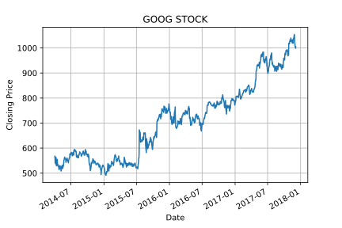

# Data Analysis in Python

This package of Jupyter notebooks covers the basics of `pandas`, and `networkx` packages, foundational packages for Data Science use. We will be focusing on the loading and preprocessing of datasets of wildly different data types and styles, with a number of end-of-chapter long examples.

Some of the highlights of Pandas include:
- A *fast and efficient* DataFrame object for data manipulation with integrated indexing
- Intelligent data alignment and handling of *missing data*.
- Flexible *reshaping* and pivoting of datasets.
- *Time-series* functionality with date range generation, frequency conversion
- Highly *optimized for performance*, with critical code paths within in Cython or C.

There are questions at the end of each Jupyter notebook to test knowledge, with the complete solutions provided in the `solutions/` folder.

Requirements:

1. `numpy`
4. `matplotlib`
5. Other performance libraries (optional); `cython`, `numba`

Prerequisites:

1. Basic level of Python
2. Introduction to NumPy
3. Introduction to Matplotlib (optional but helpful)

## Pandas Basics

**Pandas** is a core library package, but on top of **NumPy** and extensively used by the Data Science community, where it provides a powerful heterogenous data structure for data analysis. 

In this first section you will cover:
- `pandas.Series` object
- `pandas.DataFrame` object
- `pandas.Index` object
- Data Indexing and Selection
- Indexers
- Operations
- Missing value handling
- Reading and Writing to Files
- Basic aggregation
- Sorting
- Counting
- Complex Strings

For example to create a 1D series of elements we could call:

```python
>>> import pandas as pd
>>> pd.Series([3, 5, 7, 1], index=["Apples","Oranges","Pears","Lemons"])
Apples 	3
Oranges 5
Pears 	7
Lemons 	1
dtype: int64
```

A lot of the functionalities from `numpy` map over to Pandas, except that the index allows for elementwise mapping between Pandas `Series` or `DataFrame` objects. One of the key advantages of `pandas` over `numpy` is the intuitive handling of missing data:

```python
>>> import pandas as pd
>>> a = pd.Series([1, 2, 3])
>>> b = pd.Series([3, 4])
>>> a + b
0	4.0
1	6.0
2	NaN
dtype: float64
```

Where these uneven sizes would throw an exception in `numpy`, `pandas` handles this sort of operation gracefully, with options to override this default NaN behaviour if desired.

## Pandas Intermediate

The second section expands on the knowlege of `pandas` by giving the user access to some powerful features, including:
- Hierarchical Indexing
- Multi-Index/Columns
- Concat and Append
- Merge and Joins
- GroupBy
- Reshaping
- Pivot Tables

One of the advantages in Pandas is the flexibility and ease to generate and use MultiIndexes:

```python
>>> index=[("California",2000), ("California",2010),
	   ("New York",2000), ("New York",2010)]
>>> population=[33871648, 37253956, 18976457, 19378102]
>>> pop=pd.Series(population,index=index)
>>> pop
(California, 2000)    33871648
(California, 2010)    37253956
(New York, 2000)      18976457
(New York, 2010)      19378102
```

From here we can index a slice based on this multiple-index:

```python
>>> pop[("California",2010):("New York",2010)]
(California, 2010)    37253956
(New York, 2000)      18976457
(New York, 2010)      19378102
```

Or we can manipulate this multi-index directly by creating a `pandas.MultiIndex` object:

```python
>>> pd.MultiIndex.from_tuples(index)
MultiIndex(levels=[['California', 'New York'], [2000, 2010]],
           labels=[[0, 0, 1, 1], [0, 1, 0, 1]])
```

## Pandas Advanced

The third and final section on extensive Pandas touches on some of the most complex areas of Pandas, including:
- Vectorized string operations
- Categorical types
- Time-Series
- Pipes and Method Chaining
- Sparsity
- High-performance Pandas

For example, dates and times are an integral part of the Pandas package, particularly in relation to indexing time-series data:

```python
>>> dates = pd.DatatimeIndex(["2014-07-04","2014-08-04","2015-07-04","2015-08-04"])
>>> data = pd.Series([0, 1, 4, 2], index=dates)
>>> data
2014-07-04    0
2014-08-04    1
2015-07-04    4
2015-08-04    2
```

Since Pandas was built with financial modelling in mind, we go into some depth particularly with time-series data analysis and stock price modelling.



***

Inspirations: 
1. Teaching material from [Jake Vanderplas](https://github.com/jakevdp/PythonDataScienceHandbook)
2. The [Pandas cookbook](https://pandas.pydata.org/pandas-docs/stable/user_guide/cookbook.html)
3. The [World Bank](https://data.worldbank.org/)
***

The course is covered as interactive Jupyter notebooks which makes things considerably easier. In order to follow this course, we recommend you download Python using the Anaconda distribution (found [here](https://www.anaconda.com/download/)) as this also provides most of the packages used in this course.

***

Ensure that any use of this material is appropriately referenced and in compliance with the license.

All rights reserved.